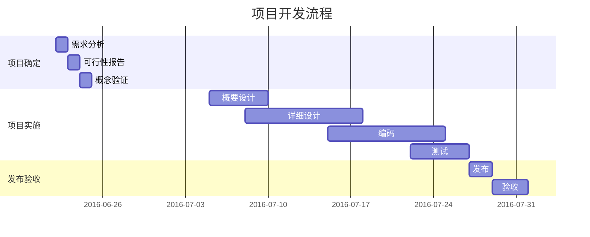

# 测试文档
## 工况说明
1、根据标准制定测试工况
2、根据用户应用确定测试工况

**H~2~O**

$ H~2~O $

$x^2$

$ \sum_{i=0}^{n}i^2 $

 $E=mc^2$

```C
int main()
{
    int q;
    return 0;
}
```
>sss

---

```
Title: Here is a title
A->B: Normal line
B-->C: Dashed line
C->>D: Open arrow
D-->>A: Dashed open arrow
```

---





```flow
st=>start: Start
op=>operation: Your Operation
cond=>condition: Yes or No?
e=>end
st->op->cond
cond(yes)->e
cond(no)->op
```